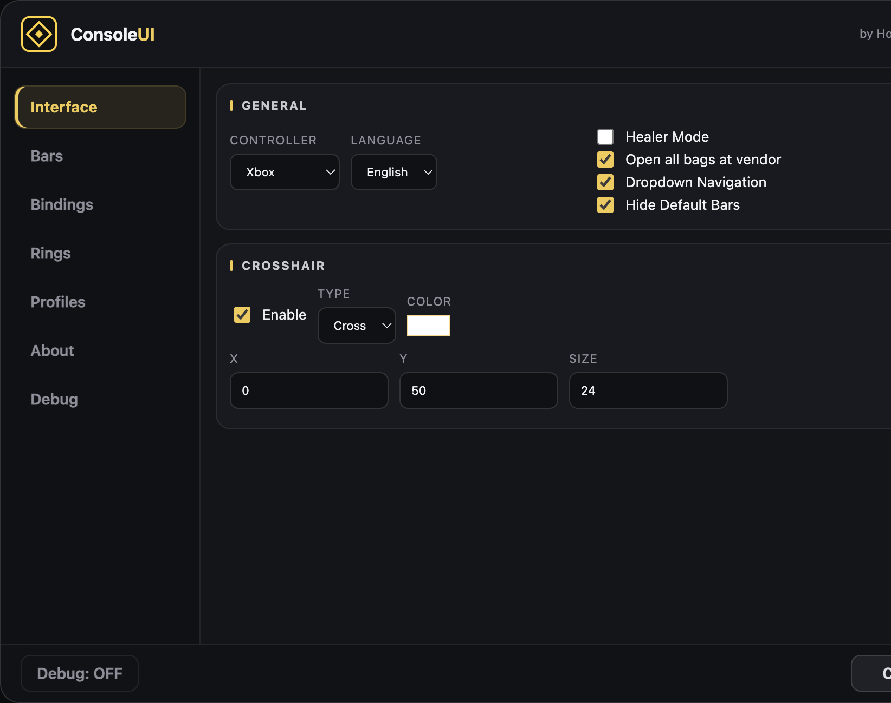
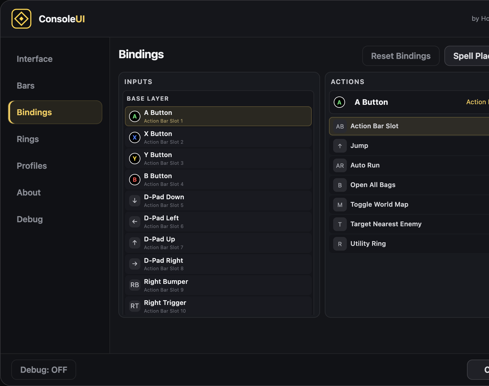
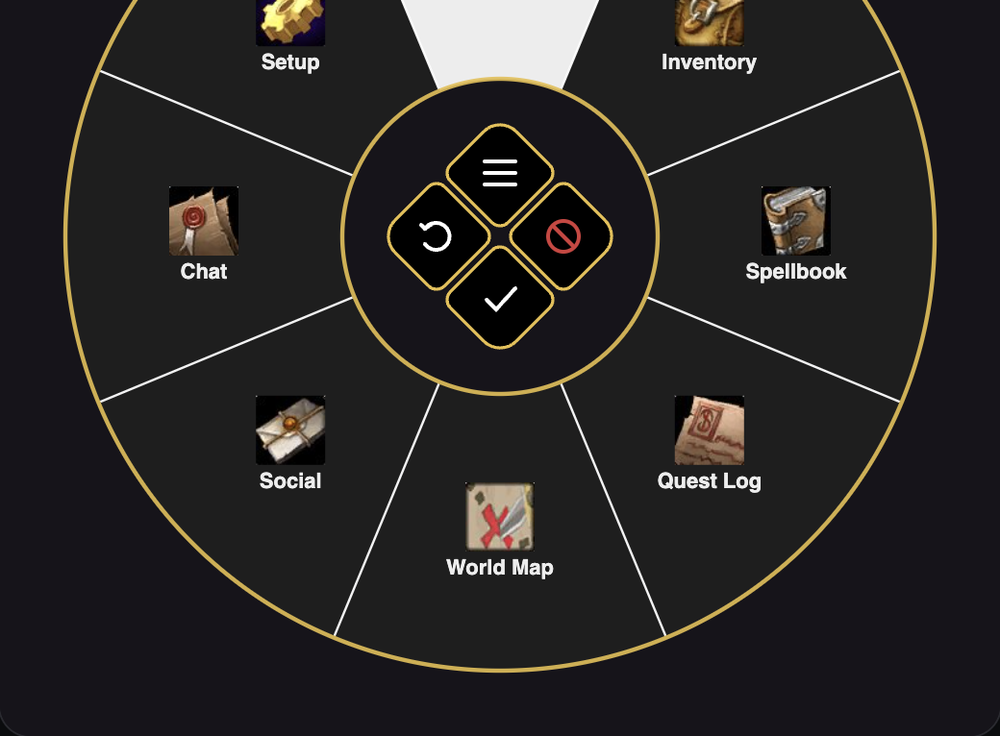
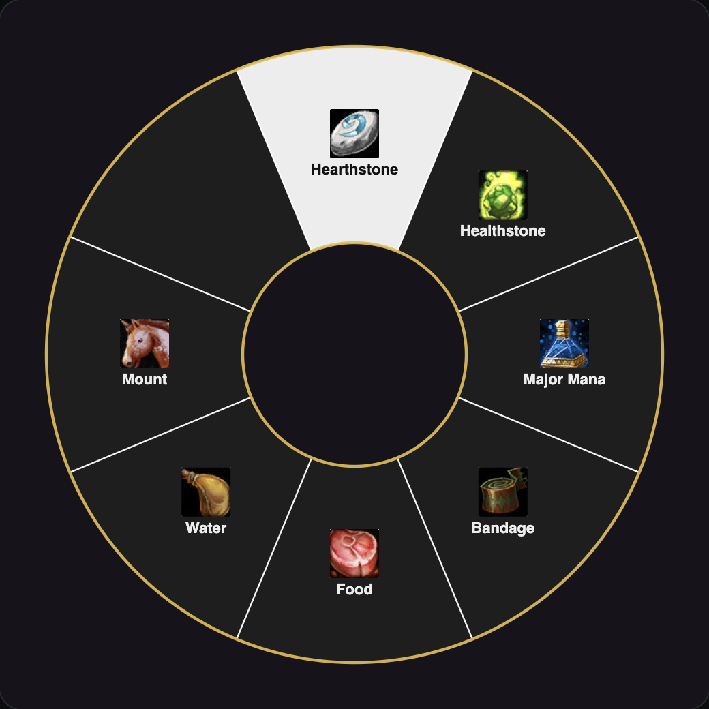
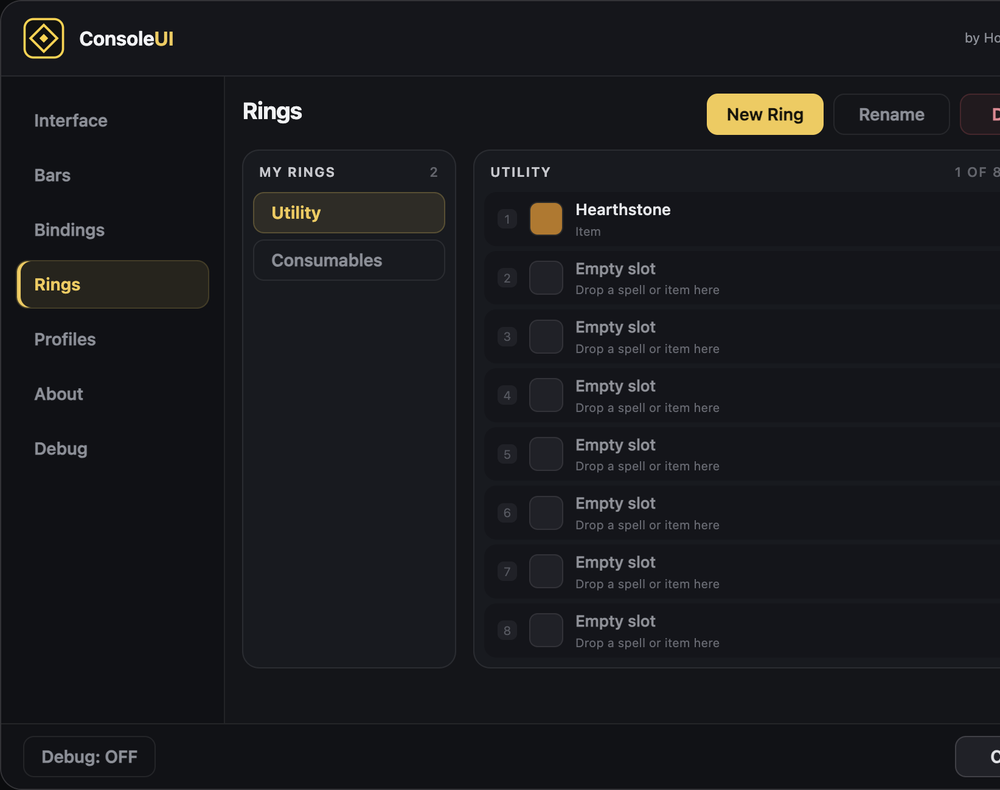
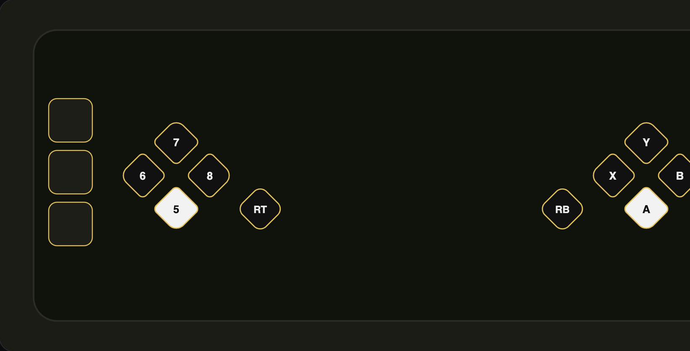
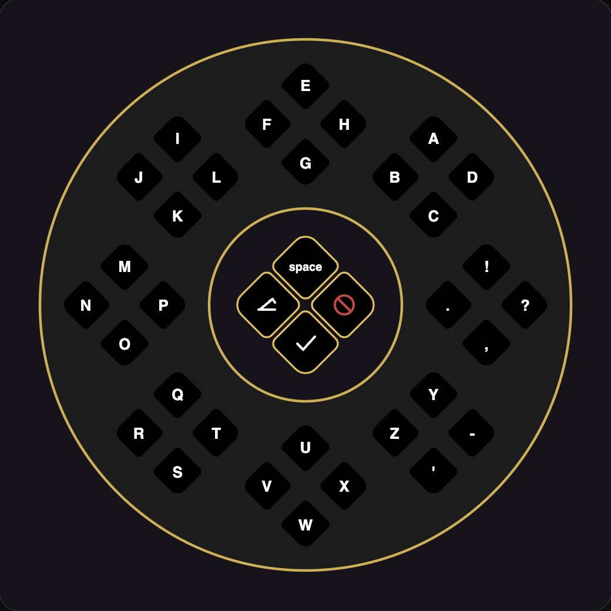

# ConsoleUI

**Play Vanilla WoW with a controller.** Built for phones, Steam Deck, Steam Link, and the couch.

ConsoleUI is a controller interface for the **original 1.12 Vanilla client**. It puts your spells on the face buttons, opens bags and menus from a stick wheel, and lets you type in chat without a keyboard.

This release is **v1.0.0-RC1** — ready to try, still a release candidate.

---

## Who this is for

You are playing Vanilla on a **private server** and you do not want to sit at a keyboard.

- **OctoWoW**
- **TurtleWoW**
- **Capybara Paradise**
- other 1.12 / Interface `11200` clients

If the server asks for a **1.12 Vanilla** client, this addon is for that. It will not work on Retail, Classic Era (modern), Wrath, or Cata.

---

## What you get

Two folders. One download.

| Addon | What it does |
| --- | --- |
| **ConsoleUI** | Action bars, Quick Menu, your own Rings, touch bars, cursor, settings |
| **ConsoleUI Keyboard** | On-screen chat keyboard. Turns on when a text box opens |

---

## Screenshots

### Settings

Open with `/cui`. Interface, Bars, Bindings, Rings, Profiles, About, Debug.

### Quick Menu

Hold the menu bind, tilt the stick, press **A** to open that panel.

### Rings

Your own 8-slice wheels — hearthstone, potions, food, a mount. Hold the bind, aim, release.

### Action bars and touch bars

Face buttons and D-pad on screen. Extra buttons on the left and right for a phone or Steam Deck.

### Chat keyboard

Point at a cluster, press a face button, type. **A** sends, **B** closes, **X** erases, **Y** is space.

---

## Install

1. Download **ConsoleUI-1.0.0-RC1.zip** from [Releases](https://github.com/racha/ConsoleUI/releases).
2. Open the zip. You will see two folders: `ConsoleUI` and `ConsoleUIKeyboard`.
3. Copy **both** into:

   `World of Warcraft/Interface/AddOns/`

4. At character select, enable **ConsoleUI** and **ConsoleUI Keyboard**.
5. Log in. Type `/cui` to open settings.

Turn **off** ConsoleExperience Classic (or any other controller bar addon) while you use this. Two addons fighting over the same bars will make a mess.

If you used an older name (`ConsolePortClassic`), delete that folder first. This one is **ConsoleUI**.

---

## First-time setup

You still need a **controller mapper** on the phone / Deck / PC (Octo, Steam Input, reWASD, whatever you already use). The addon reads keyboard keys. The mapper turns the pad into those keys.

### Suggested mapper layout

| Pad | Key |
| --- | --- |
| A | `1` |
| X | `2` |
| Y | `3` |
| B | `4` |
| D-pad Down / Left / Up / Right | `5` `6` `7` `8` |
| RB | `9` |
| RT | `0` |
| **LT** | **Shift** |
| **LB** | **Ctrl** |

That gives you **four pages** of ten buttons:

- no modifier — base page
- hold **LT** — page 2
- hold **LB** — page 3
- hold **LT + LB** — page 4

Drag spells onto the bars like a normal action bar, or use `/cui` → **Bindings** → **Spell Placement**.

Open `/cui` → **Interface** and pick **Xbox** or **PlayStation** so the on-screen icons match your pad.

---

## How to play

### Action bars

Ten diamonds on the screen: D-pad + RT on the left, Y / X / A / B + RB on the right.

Press the matching pad button to use that slot. Hold LT or LB to change page.

`/cui` → **Bars** if you want them bigger, gold-edged, or moved.

### Quick Menu (the Radial Menu)

This is the big gold wheel in the middle of the screen.

1. Bind **Toggle Radial Menu** in `/cui` → **Bindings** (many people put it on a spare button).
2. Hold it. Tilt the **left stick** (or WASD) toward a slice.
3. **A** opens that window (Character, bags, spellbook, quests, map, social, chat, settings).
4. Center buttons while it is open:
   - **Y** — game menu
   - **X** — reload the UI
   - **A** — confirm the highlighted slice
   - **B** — close

Walk keys come back when you close it.

### Rings (your own wheels)

Rings are extra wheels you fill yourself. Eight slices each. Spells or bag items.

**Make one**

1. `/cui` → **Rings** → **New Ring**.
2. Pick the ring on the left.
3. Pick up a spell or an item (from the spellbook or a bag).
4. Drop it on an empty slice.

**Use one**

1. `/cui` → **Bindings**.
2. Select a button (for example LT + D-pad Up).
3. On the right, pick your ring.
4. In the world: **hold** that button, tilt toward a slice, **let go** to use it.

Do not put a ring on **B**. B is also “cancel”, so that fight never ends well. Use LT / LB pages or the D-pad.

### Touch bars (phone and Steam Deck)

Two optional strips on the left and right edge of the screen. Tap them with a thumb.

`/cui` → **Bars** → turn **Left touch bar** / **Right touch bar** on. Set how many buttons (1–5) and how far from the edge.

Then `/cui` → **Bindings** → **Touch bars** and give each slot a spell, a jump, a ring, or whatever you want.

### Cursor

When a bag, vendor, or other window is open, the stick can move a cursor around the slots. **A** clicks, **B** closes. Turn pieces of this on or off under Bindings if it gets in the way.

### Chat keyboard

Install **ConsoleUI Keyboard** next to ConsoleUI.

Open chat (Quick Menu → Chat, or your chat bind). The gold wheel appears.

- Tilt toward a cluster of four letters.
- Press **Y / X / A / B** for the letter in that diamond.
- **Y** in the center = space
- **X** = erase
- **A** = send
- **B** = close

`/cuik off` turns the keyboard off. `/cuik on` turns it back on.

---

## If something breaks

Do this before you write a report. It saves everyone a lot of guesswork.

1. Type `/cui`
2. Click **Debug**
3. Turn **Debug: ON** at the bottom
4. Do the thing that broke (open the menu, try to walk, open chat…)
5. Go back to **Debug**
6. Press **Select All**, copy (**Ctrl+C** or your paste bind)
7. Paste that into the GitHub issue

Also send:

- the **first red error** on screen, if there is one
- a **screenshot**
- which client you are on (OctoWoW, Turtle, Capybara…)

Useful extras:

- `/cui debug` — prints the same report in chat
- `/reload` — reload the UI after you change files

If you **cannot walk** after closing a menu or the keyboard, `/reload` once. If it happens again, send the Debug copy.

---

## Commands

| Command | What it does |
| --- | --- |
| `/cui` | Open settings |
| `/cui debug` | Print a diagnostic report |
| `/cui debug on` / `off` | Extra debug messages |
| `/cui modern` / `classic` | Action-bar look |
| `/cui gold` / `gold off` | Gold border on the bars |
| `/cuik` | Keyboard status |
| `/cuik on` / `off` | Enable or disable the chat keyboard |

---

## Credits

ConsoleUI stands on work a lot of people already did.

- [ConsoleExperience Classic](https://github.com/pepordev/ConsoleExperienceClassic) — Pedro / pepordev
- [ConsolePortLK](https://github.com/leoaviana/ConsolePortLK) — leoaviana
- [ConsolePort](https://github.com/seblindfors/ConsolePort) — Sebastian Lindfors / MunkDev

Made by **HouseLegend**.

---

## License

Use it, share it, fix it. If you publish a change, keep the credits above.
